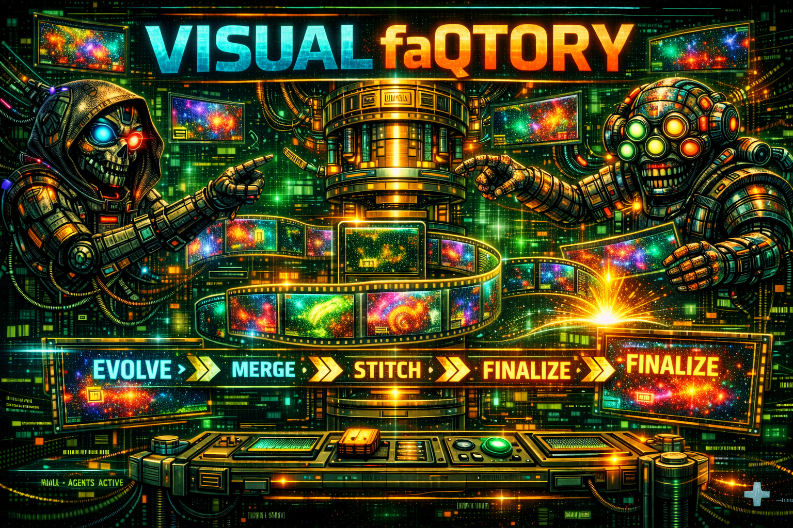

# QonQrete Visual FaQtory v0.0.5-alpha
[](LICENSE)




```
 ██╗   ██╗██╗███████╗██╗   ██╗ █████╗ ██╗         ███████╗ █████╗  ██████╗ ████████╗ ██████╗ ██████╗ ██╗   ██╗
 ██║   ██║██║██╔════╝██║   ██║██╔══██╗██║         ██╔════╝██╔══██╗██╔═══██╗╚══██╔══╝██╔═══██╗██╔══██╗╚██╗ ██╔╝
 ██║   ██║██║███████╗██║   ██║███████║██║         █████╗  ███████║██║   ██║   ██║   ██║   ██║██████╔╝ ╚████╔╝
 ╚██╗ ██╔╝██║╚════██║██║   ██║██╔══██║██║         ██╔══╝  ██╔══██║██║▄▄ ██║   ██║   ██║   ██║██╔══██╗  ╚██╔╝
  ╚████╔╝ ██║███████║╚██████╔╝██║  ██║███████╗    ██║     ██║  ██║╚██████╔╝   ██║   ╚██████╔╝██║  ██║   ██║
   ╚═══╝  ╚═╝╚══════╝ ╚═════╝ ╚═╝  ╚═╝╚══════╝    ╚═╝     ╚═╝  ╚═╝ ╚══▀▀═╝    ╚═╝    ╚═════╝ ╚═╝  ╚═╝   ╚═╝
```

> **Automated Long-form AI Visual Generation for Music, DJ Sets & Experimental AV**
>
> **v0.0.5-alpha** — Project-based runs, final video stitching, strict pipeline

---

## What This Does

Visual FaQtory takes a text prompt or base image and generates hours of evolving, loopable visual content. Each cycle produces a seamless loop that morphs into the next, creating an infinite visual journey. Perfect for DJ sets, video installations, streams, and experimental AV.

---

## Supported Modes

| Mode | Cycle 0 | Cycle N>0 |
|------|---------|-----------|
| `text` | text → image → video | video → video (evolution) |
| `image` | image → video (skip img gen) | video → video (evolution) |
| `video` | ❌ Not valid for cycle 0 | video → video (evolution) |

After cycle 0, the pipeline always chains: previous video → extract frame → img2img → img2vid → loop. Visual identity is **never hard-reset** between cycles.

---

## Requirements

- **Python** 3.10+
- **FFmpeg** (with h264_nvenc or libx264)
- **GPU** (for real backends; mock requires none)
- **pyyaml**, **pillow** (pip install)

---

## Quick Start

```bash
# 1. Enter directory
cd visual-faqtory-v0.0.5-alpha

# 2. Install dependencies
pip install pyyaml pillow

# 3. Quick smoke test (mock backend, no GPU needed)
python quick_test.py

# 4. Run 3 cycles as a named project
python vfaq_cli.py run -n test-run -c 3 -b mock --delay 1

# 5. Check the project output
ls worqspace/qonstructions/test-run/videos/

# 6. Assemble final video
python vfaq_cli.py assemble -n test-run
```

---

## CLI Reference

```bash
# Run generation
python vfaq_cli.py run [OPTIONS]
  -n, --name NAME      Project name (stored in worqspace/qonstructions/<n>/)
  -c, --cycles N       Run N cycles (default: unlimited)
  --hours H            Target H hours of content
  -b, --backend TYPE   Override backend (mock/comfyui/diffusers/replicate)
  --delay SECONDS      Delay between cycles (default: 2)
  --fresh              Start fresh (ignore saved state)

# Single test cycle
python vfaq_cli.py single [-n NAME] [--cycle N] [-b BACKEND]

# Check status
python vfaq_cli.py status [-n NAME]

# List available backends
python vfaq_cli.py backends

# Assemble all videos into final_output.mp4
python vfaq_cli.py assemble [-n NAME] [--preview]

# Clean up
python vfaq_cli.py clean [-n NAME] [--all]
```

---

## Project-Based Runs

When you use `-n <project-name>`, all outputs go into a structured project directory:

```
worqspace/qonstructions/<project-name>/
├── briqs/                    # VisualBriq JSON state files
├── images/                   # Generated source images
├── videos/                   # Per-cycle looped MP4s + raw videos
│   ├── cycle0000_raw.mp4
│   ├── cycle0000_video.mp4
│   ├── cycle0001_raw.mp4
│   └── cycle0001_video.mp4
├── factory_state.json        # Pipeline state (resumable)
├── config_snapshot.yaml      # Config used for this run
└── final_output.mp4          # Stitched final video
```

If you omit `-n`, the run uses a temporary directory (`qodeyard/`). After completion, you're prompted to save it as a named project.

---

## Config vs tasq.md (Strict Separation)

**tasq.md** = Creative intent ONLY:
- `title`, `mode`, `backend`, `input_image`/`base_image`
- Descriptive prompt text
- Negative prompt text

**config.yaml** = Mechanical truth ONLY:
- `width`, `height`, `fps`, `duration`, `steps`
- `video_frames`, `clip_seconds`, `cfg_scale`
- All diffusion parameters, codec settings, etc.

Mechanical parameters in tasq.md are **ignored with a warning**.

---

## Backend Options

| Backend | Availability | Setup |
|---------|-------------|-------|
| `mock` | ✅ Always | None needed |
| `comfyui` | ✅ Works | ComfyUI server + SDXL/SVD checkpoints |
| `diffusers` | ⚠️ Needs CUDA | `pip install torch diffusers` |
| `replicate` | ⚠️ Needs token | `REPLICATE_API_TOKEN` env var |

ComfyUI validates SDXL and SVD checkpoint availability via `/object_info` before generating. NVENC encoding is preferred; libx264 is automatic fallback.

---

## Known Limitations (v0.0.5-alpha)

- Video mode does frame extraction (not true video2video via AnimateDiff)
- ComfyUI needs VideoHelperSuite nodes for video output
- Diffusers backend requires CUDA (no CPU fallback)
- LLM evolution is optional (basic fallback always works)

---

## License

AGPL-3.0 (same as QonQrete)

---

Built by **Ill Dynamics / WoNQ** for the drum & bass massive 🎵

```
░▒▓█ ONE LOVE █▓▒░
```

## License

Visual FaQtory is licensed under the GNU Affero General Public License v3.0 (AGPL-3.0).
See the [LICENSE](LICENSE) file for full text.


