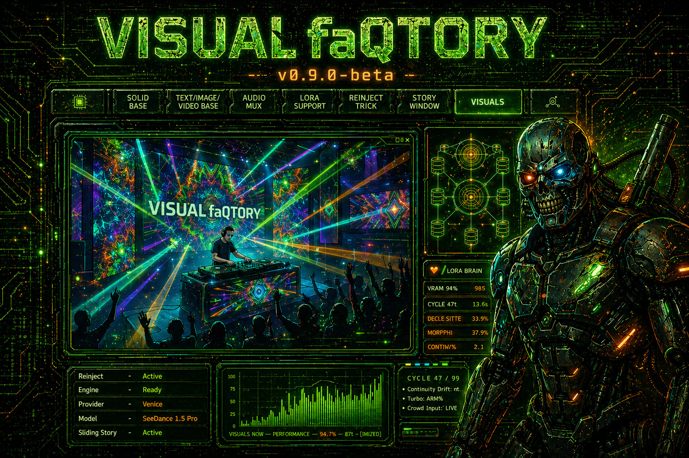

# Visual FaQtory v0.9.3-beta
[](LICENSE)



Automated long-form AI visual generation pipeline for music, DJ sets, and experimental audiovisual projects.

Runs a sliding-window paragraph story through a configurable backend chain — generating images, videos, and morphs per cycle — and assembles them into a final output video.

**Backends:** ComfyUI · Venice · Veo  
**Features:** Reinject / img2vid chaining · Crowd Control QR overlay · Live OBS integration · ETA spinner · Per-op timing

---

## Quickstart

```bash
# 1. Clone & install
git clone https://your-repo/visual-faqtory.git
cd visual-faqtory
pip install -r requirements.txt

# 2. Set API key (Venice example)
export VENICE_API_KEY=your_key_here

# 3. Drop your story into worqspace/
cp my_story.txt worqspace/story.txt

# 4. Optionally add a base image
cp my_base.jpg worqspace/base_images/

# 5. Run
python vfaq_cli.py run -n my-run

# 6. Resume from checkpoint
python vfaq_cli.py run -n my-run --resume
```

**Config** is in `worqspace/config.yaml`. The default is Venice all-backends.  
See [`doc/DOCUMENTATION.md`](doc/DOCUMENTATION.md) for full config reference.

---

## Project Layout

```
worqspace/          User workspace — story, config, base images, prompts
vfaq/               Core Python package
  venice_backend.py   Venice image + video backend
  veo_backend.py      Google Veo backend
  backends.py         Backend interface + ComfyUI backend
  sliding_story_engine.py  Main cycle engine
  visual_faqtory.py   Run orchestrator
  crowd_control/      Live QR crowd-control server
vfaq_cli.py         CLI entry point
doc/                Documentation
```

---

## Documentation

| Doc | Description |
|---|---|
| [`doc/DOCUMENTATION.md`](doc/DOCUMENTATION.md) | Full config reference, pipeline architecture, backend guide |
| [`doc/LIVE-INTEGRATION-GUIDE.md`](doc/LIVE-INTEGRATION-GUIDE.md) | OBS + SRT live streaming integration |
| [`doc/EXTERNAL-LIVE-VISUALS-SETUP.md`](doc/EXTERNAL-LIVE-VISUALS-SETUP.md) | External live visuals setup |
| [`doc/RELEASE-NOTES.md`](doc/RELEASE-NOTES.md) | Full changelog |
| [`doc/BACKEND-VALIDATION-REPORT.md`](doc/BACKEND-VALIDATION-REPORT.md) | Backend validation results |
| [`doc/VALIDATION-REPORT.md`](doc/VALIDATION-REPORT.md) | Pipeline validation report |
| [`doc/SRT-LIVE-OPS-REPORT.md`](doc/SRT-LIVE-OPS-REPORT.md) | SRT live ops report |

---

## Built by RikkeTik / Ill Dynamics (Ricky van Poppel)

## License
Visual FaQtory is licensed under the GNU Affero General Public License v3.0 (AGPL-3.0).
See the [LICENSE](LICENSE) file for full text.
