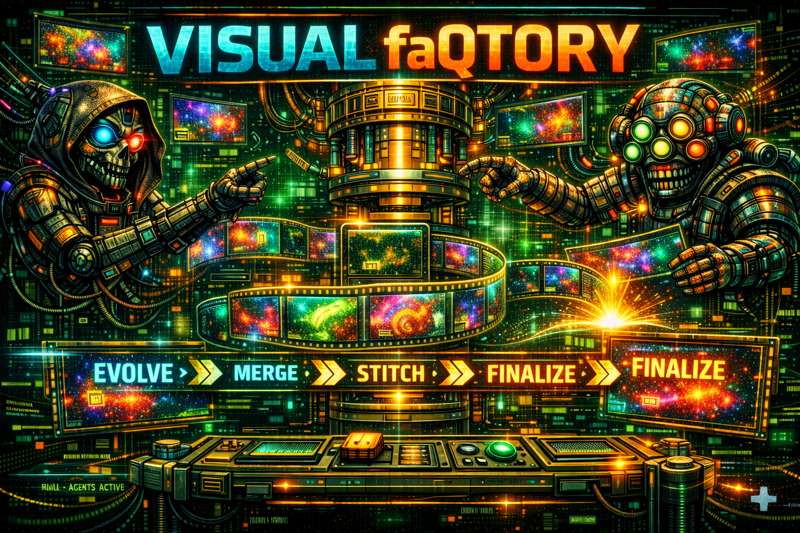

# QonQrete Visual FaQtory v0.5.8-beta
[](LICENSE)




**Automated long-form AI visual generation for music, DJ sets, and experimental audiovisual projects.**

Visual FaQtory takes a written story, splits it into paragraphs, and generates a continuous visual narrative using a sliding window engine. Each cycle produces a keyframe and transition video, chaining frames across cycles for visual continuity. The final output is stitched, interpolated to 60fps, upscaled to 1080p, and optionally muxed with audio.

---

## Features

**Paragraph Story Engine** — Write your narrative in `worqspace/story.txt`. The sliding window engine splits paragraphs into overlapping windows, producing one visual cycle per window step (ramp-up → slide → ramp-down).

**Strict Timing Normalization** — Timing parameters (frames, FPS, duration) are normalized *before* generation based on a configurable `timing_authority` (frames, duration, or fps). This ensures precise control over video length and frame count.

**Per-Cycle Interpolation** — Optionally, each generated raw SVD video can be interpolated to a higher FPS immediately after generation, before stitching. This uses `run/videos_interpolated/` for these files, and the final stitch will use these interpolated versions. Fallback to raw video occurs if interpolation fails.

**Reinject Mode (Default ON)** — Every cycle generates a new img2img keyframe from the previous cycle's last frame, ensuring visual evolution while maintaining continuity. Disable with `--no-reinject` for direct last-frame conditioning.

**Three Input Modes** — Start from text (txt2img), a base image (img2img), or a video (frame extraction → img2img). After cycle 0, all modes chain via last-frame reinject.

**ComfyUI Backend** — Production backend using the ComfyUI API. SDXL for image generation, SVD for video generation. Mock backend available for testing.

**LoRA Support** — Optional LoRA injection into ComfyUI workflows for stylistic control. Configure in `config.yaml` with path, strength, and automatic workflow wiring.

**Audio Sync** — Drop audio into `worqspace/base_audio/`. Optionally auto-compute cycle count from audio duration. Final video is muxed with audio after all processing.

**Finalizer Pipeline** — Automatic post-processing: stitch → interpolate 60fps → upscale 1920×1080 → audio mux. GPU-accelerated encoding with h264_nvenc fallback to libx264.

**Crowd Control** — Live audience prompt injection via QR code. Run the crowd server on the visuals machine, add the QR overlay in OBS, and viewers submit prompts that get injected into the next generation cycle. Rate limiting, bad word filtering, and fail-open design ensure safe, uninterrupted operation. See [DOCUMENTATION.md](DOCUMENTATION.md#15-crowd-control) for full setup.

**Project Saving** — After completion, runs are saved to `worqspace/saved-runs/<project-name>/` with the deliverable renamed to `<project-name>.mp4`. Full reproducibility via copied config snapshots and per-cycle briq JSON.

---

## Quick Start

```bash
# 1. Install dependencies
pip install -r requirements.txt

# 2. Write your story
nano worqspace/story.txt

# 3. Configure backend
nano worqspace/config.yaml    # Set backend.api_url to your ComfyUI instance

# 4. Run
python vfaq_cli.py
python vfaq_cli.py -n my-project          # Named project
python vfaq_cli.py --mode image           # Use base image
python vfaq_cli.py --no-reinject          # Disable reinject
python vfaq_cli.py --dry-run              # Validate without generation
python vfaq_cli.py -n test -b mock        # Mock backend test
```

---

## Directory Structure

```
visual-faqtory/
├── vfaq_cli.py                    # CLI entrypoint
├── vfaq/                          # Core pipeline modules
│   ├── visual_faqtory.py          # Main orchestrator
│   ├── sliding_story_engine.py    # Paragraph story engine
│   ├── backends.py                # ComfyUI + Mock backends
│   ├── construqtor.py             # Visual construction agent
│   ├── instruqtor.py              # Instruction preparation agent
│   ├── inspeqtor.py               # Quality inspection agent
│   ├── finalizer.py               # Stitch + interpolate + upscale
│   ├── prompt_synth.py            # Deterministic prompt synthesis
│   ├── prompt_bundle.py           # Prompt file loading
│   ├── visual_briq.py             # Instruction unit dataclass
│   ├── base_folders.py            # Input file detection
│   ├── image_metrics.py           # Image quality metrics
│   └── timing.py                  # Timing normalization module (NEW)
├── worqspace/                     # Operator workspace
│   ├── config.yaml                # Pipeline configuration
│   ├── story.txt                  # Story paragraphs
│   ├── motion_prompt.md           # Motion/camera hints
│   ├── style_hints.md             # Style modifiers
│   ├── evolution_lines.md         # Per-cycle evolution guidance
│   ├── negative_prompt.md         # Negative prompt
│   ├── base_images/               # Base images for image mode
│   ├── base_video/                # Base videos for video mode
│   ├── base_audio/                # Audio files for muxing
│   └── saved-runs/                # Archived project runs
├── run/                           # Current run output (transient)
│   ├── videos/                    # Per-cycle raw SVD videos
│   ├── videos_interpolated/       # Per-cycle interpolated videos (if enabled)
│   ├── frames/                    # Keyframes and last-frames
│   ├── briqs/                     # Per-cycle JSON state
│   ├── meta/                      # Config/story snapshots
│   └── faqtory_state.json         # Run state tracking
├── vfaq_story_setup.sh            # Interactive story setup helper
├── requirements.txt               # Python dependencies
└── VERSION                        # Version file
```

---

## CLI Reference

```
python vfaq_cli.py [command] [options]

Commands:
  run        Run visual generation (default when no command given)
  status     Show pipeline status and saved runs
  backends   List available backends

Run Options:
  -n, --name NAME         Project name for saving
  --reinject, -r          Enable reinject mode (default: ON)
  --no-reinject, -R       Disable reinject mode
  --mode {text,image,video}  Override input mode
  -b, --backend TYPE      Override backend (mock/comfyui)
  -s, --seed SEED         Override base seed
  --config PATH           Override config file path
  --dry-run               Validate config without generation
  --lora-enabled          Enable LoRA injection
  --no-lora               Disable LoRA injection
  --lora-path PATH        Path to LoRA safetensors file
  --lora-strength FLOAT   LoRA weight (0.0 to 1.0)

Global Options:
  -w, --worqspace DIR     Worqspace directory (default: ./worqspace)
  --run-dir DIR           Run output directory (default: ./run)
  -V, --version           Show version
```

---

## Backend Support

| Backend | Status | Requirements |
|---------|--------|-------------|
| `comfyui` | ✅ Production | ComfyUI server running at `api_url` |
| `mock` | ✅ Testing | None (generates placeholder files) |

---

## Prompt Files

| File | Purpose |
|------|---------|
| `story.txt` | Main narrative (paragraphs separated by blank lines) |
| `motion_prompt.md` | Camera/motion hints appended to prompts |
| `style_hints.md` | Style modifiers appended to prompts |
| `evolution_lines.md` | Per-cycle evolution guidance |
| `negative_prompt.md` | Negative prompt text |
| `transient_tasq.md` | Optional per-run overrides |

---

## Finalizer Output Naming

After all cycles complete, the finalizer produces:

1. `run/final_output.mp4` — stitched cycle videos (can be raw or per-cycle interpolated)
2. `run/final_60fps_1080p.mp4` — final deliverable after post-stitch interpolation and upscale (if enabled)

On save, the best deliverable (`final_60fps_1080p.mp4` if it exists, otherwise `final_output.mp4`) is renamed to `<project-name>.mp4` in `worqspace/saved-runs/<project-name>/`.

---

## Requirements

- Python 3.10+
- FFmpeg (with h264_nvenc for GPU encoding, or libx264 fallback)
- ComfyUI server (for production runs)
- SDXL checkpoint (for image generation)
- SVD checkpoint (for video generation)

---

## License

AGPL-3.0 — Same as QonQrete.

Built by **Ill Dynamics** / **WoNQ** 🎧
